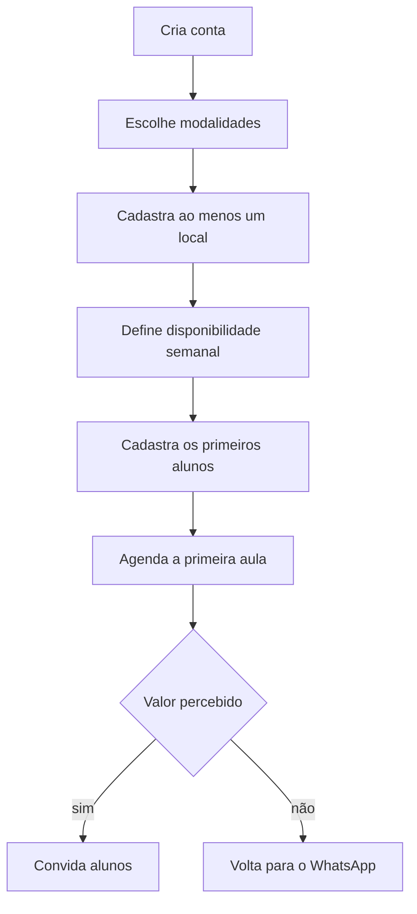
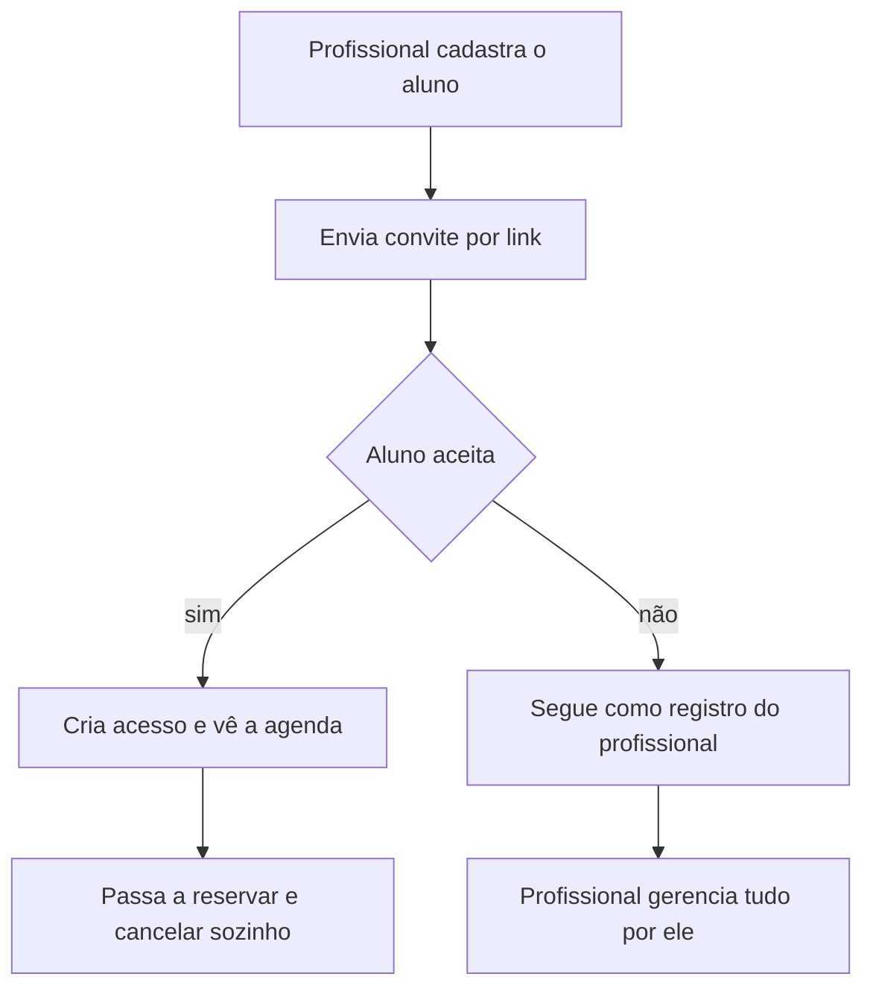
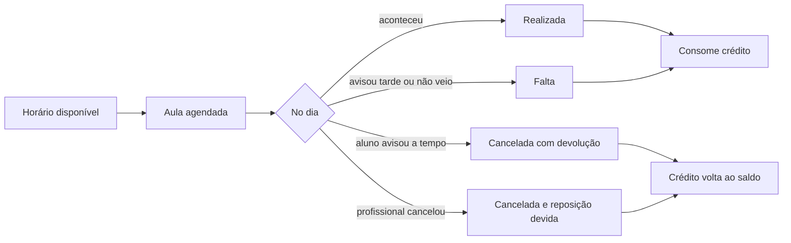
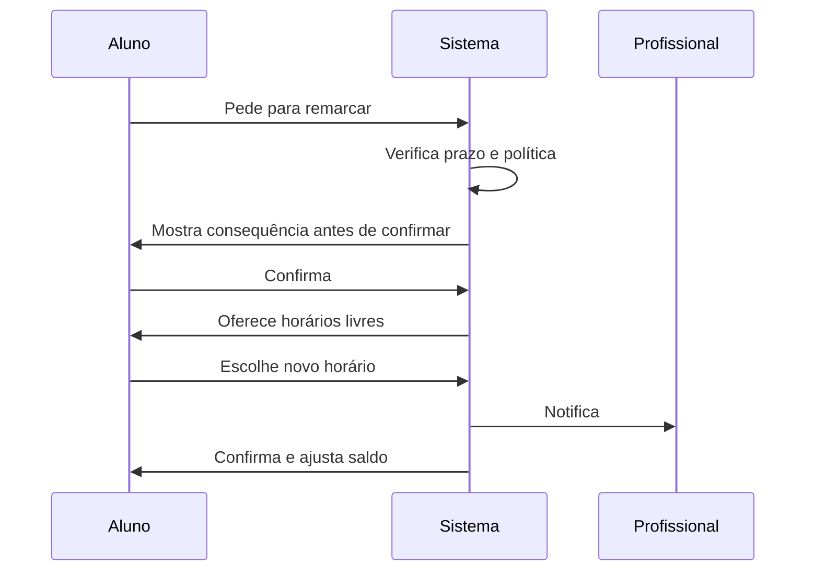
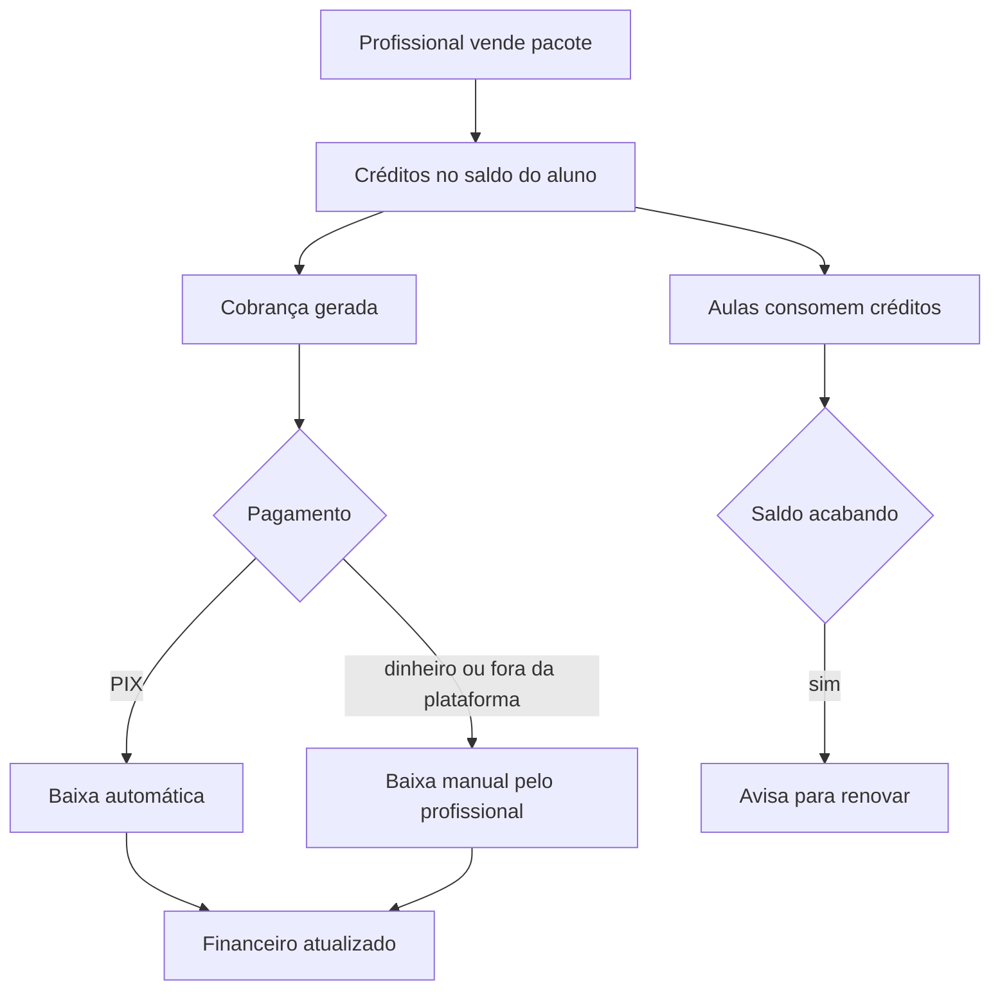

# Jornadas principais

Documento de Fase 0. Os quatro fluxos que o MVP precisa acertar.

Última atualização: 2026-08-19

---

## 1. Onboarding do profissional

O momento mais frágil do produto. Se ele não chegar à primeira aula agendada na primeira
sessão, não volta.

**Regra de projeto:** cada etapa precisa ser pulável e retomável. Obrigar o preenchimento
completo antes de agendar a primeira aula é o caminho mais curto para o abandono.

---

## 2. Entrada do aluno

**Ponto crítico:** o aluno que **não** aceita o convite não pode quebrar nada. O profissional
precisa conseguir operar 100% do sistema sem que nenhum aluno tenha conta. A conta do aluno
é um ganho, nunca um pré-requisito.

---

## 3. Ciclo da aula

As regras de "a tempo", "consome crédito" e "reposição devida" **não são decididas aqui** —
são das fases 6 e 7. O que esta jornada fixa é que os quatro desfechos existem e precisam
caber no modelo.

---

## 4. Remarcação

A operação mais frequente do dia a dia e a que mais consome tempo hoje. Se o produto acertar
só uma coisa, é esta.

**O ganho está em o profissional não participar da conversa.** Ele só é notificado do
resultado. Qualquer desenho em que a remarcação exija aprovação manual dele reproduz o
problema do WhatsApp dentro do sistema.

---

## 5. Ciclo financeiro

**Baixa manual é requisito, não concessão.** Uma parte relevante dos pagamentos vai continuar
acontecendo em dinheiro ou por PIX direto entre as pessoas. Um sistema que só registra o que
passa por ele mostra um financeiro falso — e financeiro falso faz o profissional parar de
confiar no produto inteiro.
